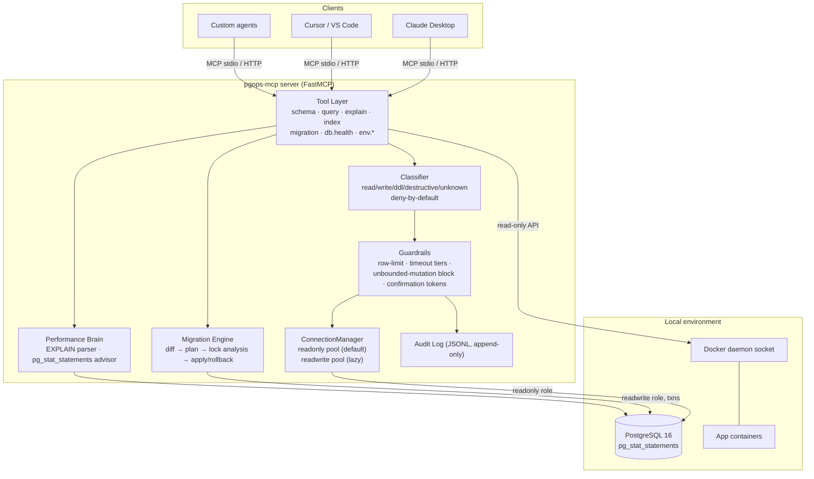

# ARCHITECTURE — pgops-mcp System Design

**Status:** v1.0 · **Last updated:** 2026-08-24

## High-level view



## Key design decisions (summary — full reasoning in ADRs)

| Decision | Choice | Over | Why |
|---|---|---|---|
| Transport | stdio first | HTTP first | Claude Desktop/Cursor native; zero network surface; HTTP later for remote use |
| DB driver | asyncpg | psycopg3 | true async, faster, binary protocol |
| Safety model | classifier + roles + tokens | prompt-based caution | prompts don't stop `DELETE`; architecture does |
| Classifier default | deny-by-default | allow-by-default | unknown SQL must be treated as dangerous |
| Migrations | own ledger table | external tools (sqitch/flyway) | agent-native, checksummed, no extra install; interop later if asked |
| Lock analysis | heuristics + known-safe patterns | exact simulation | honest estimates with confidence beat false precision |
| Docker access | read-only API default | full access | restart/exec behind explicit approval-mode flag |
| Tests | testcontainers (real Postgres) | mocks | guardrails must be proven against the real engine |

## Data flow: a destructive write

```
agent calls query.write("DELETE FROM orders")
  → Classifier: DELETE, no WHERE → class=destructive
  → Guardrails: refuse execution, issue confirmation token (TTL 5min) + reason
  → agent relays reason to user; user approves
  → agent re-calls query.write(sql, confirm_token)
  → token validated (single-use, unexpired) → executes on readwrite pool
  → audit log entry written (sql, duration, rows affected, verdict)
```

## Data flow: migration with lock analysis

```
migration.plan(target_schema)
  → schema.diff(live, target) → ordered change set
  → per-step lock analysis: op class × live table size → estimate + confidence + reasoning
  → unsafe patterns rewritten to safe multi-step patterns where possible
     (e.g., NOT VALID + VALIDATE split; CREATE INDEX CONCURRENTLY)
  → dry-run validation inside rolled-back transaction (where step allows)
  → returns plan artifact; nothing applied yet
migration.apply(plan_id, confirm_token)
  → versioned ledger insert → transactional apply → verify → ledger update
```

## Failure modes considered

- Postgres restarts mid-migration → ledger shows in-flight; next apply verifies and resumes/refuses safely
- Agent hallucinates a tool argument → Pydantic schemas reject; structured error returned
- Two clients share one server → single audit log, serialized write pool; document limitation
- Docker socket unavailable → env tools degrade gracefully with clear errors; DB tools unaffected

## Scaling notes

Single-node local tool by design. If remote/multi-DB demand appears: same core behind
Streamable HTTP with per-DSN sessions — deliberately out of scope for v1.
