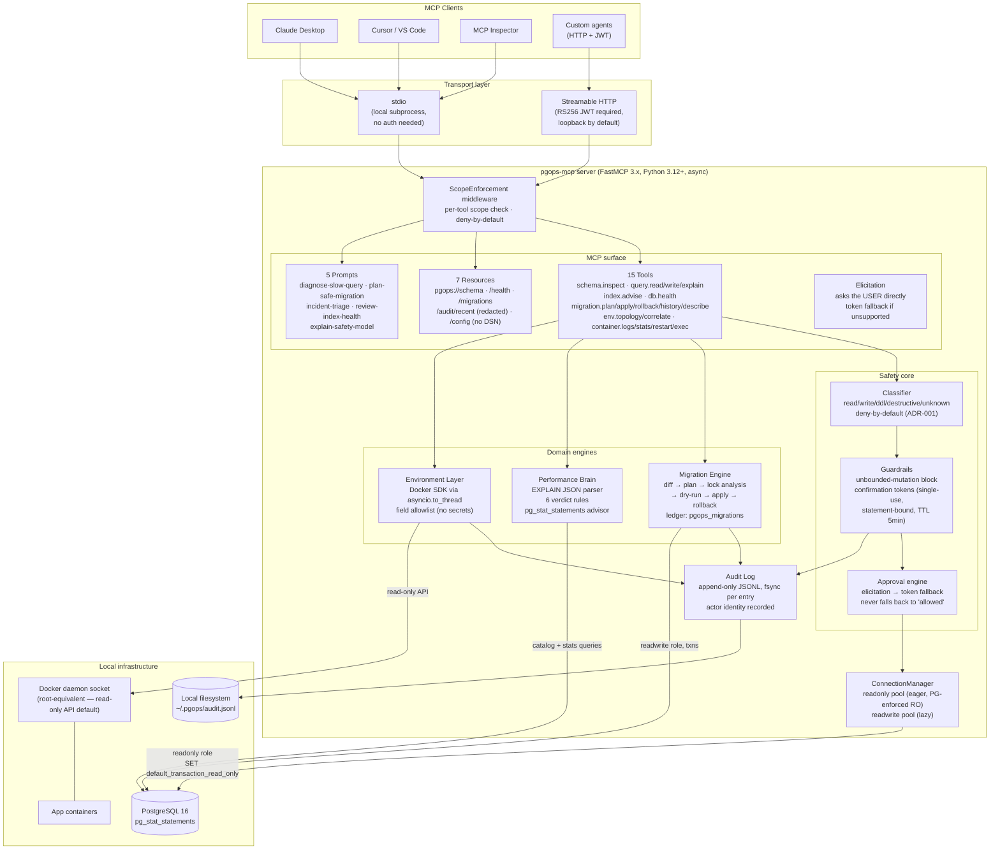
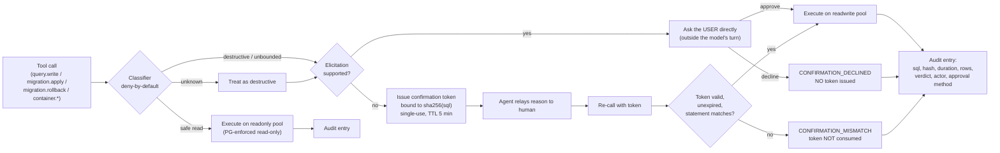
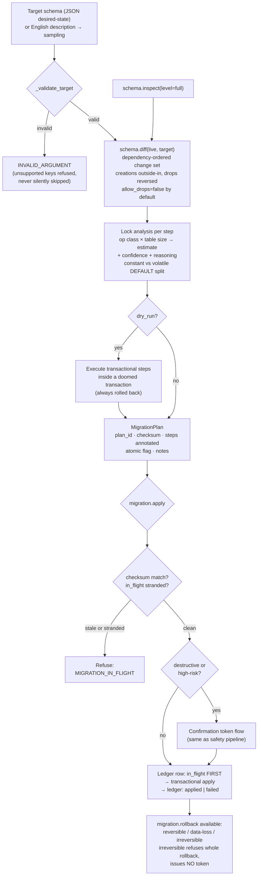
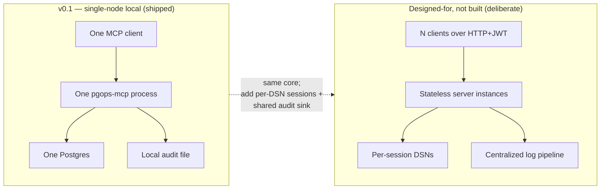

# System Design — pgops-mcp

Rendered architecture diagrams. The source of truth for *why* each component exists is
[`ARCHITECTURE.md`](ARCHITECTURE.md); this page is the visual companion.

---

## 1. High-level system view

---

## 2. Safety pipeline — every write goes through this

**The load-bearing property:** approval never degrades to "allowed". Losing elicitation
downgrades "the human was asked" to "the agent asserts the human was asked" — weaker,
but still gated.

---

## 3. Migration engine data flow

---

## 4. Deployment topology — what scales and what doesn't

### Honest scaling assessment

This is **a local-first developer tool, not a horizontally-scaled service** — and that
is a design decision, not an omission:

| Dimension | Status | Why |
|---|---|---|
| Concurrency within one server | ✅ fine | async pools; readonly pool sized 5, readwrite deliberately 2 |
| Multiple clients, one server | ⚠️ works with caveats | shared audit log, serialized writes — documented limitation |
| Multi-tenant (many users, many DBs) | ❌ not built | every authenticated caller shares one `ConnectionManager`; scoped tokens limit *what*, not *which database* |
| Horizontal scale-out | ❌ not built | plan cache and token store are **in-memory**, so instances can't share state |
| High availability | ❌ not applicable | it's an operator's sidecar, not a service with an SLA |

What the design *does* give you when demand appears:

- **Transport-agnostic tool layer** (ADR-002): HTTP already shipped behind JWT auth;
  adding Streamable HTTP multi-client support doesn't touch tools.
- **Stateless-friendly auth**: RS256 public-key verification means any instance can
  verify tokens with no shared secret.
- **The two real blockers are named**: per-session DSN isolation and a shared audit
  sink. Both are listed as known gaps rather than quietly assumed away.

For its actual job — one engineer pointing AI agents at their own database safely —
the current topology is correct, and pretending otherwise would add distributed-systems
failure modes to a tool whose whole value proposition is being trustworthy.
